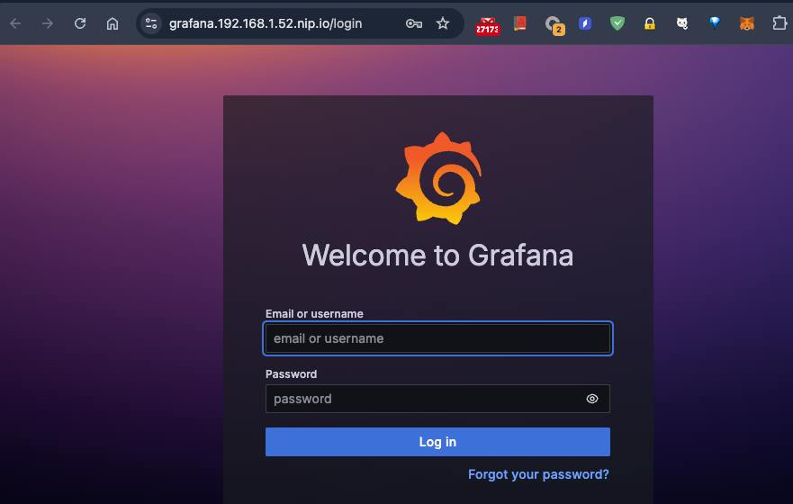

В данном гайде мы настроим автоматический выпуск “валидных” сертификатов в локальном kubernetes кластере. В качестве примера запустим приложение grafana.



Что будем делать:

1. Развернем локально кластер локально. Установим MetalLB, cert-manager, ingress и поднимем тестовое приложение grafana.
2. Настроим нашу систему так, чтобы она доверяла выпущенным в кубе сертификатам.
3. Используем nip.io, чтобы не заморачиваться с hosts-файлом

## Поднимаем кластер

Тут совершенно нет никаких проблем, я буду использовать стандартный Docker Desktop для запуска. Ставим галочку в настройках Docker Desktop, что нам нужен куб и погнали дальше.

## Настройка MetalLB

MetalLB — это балансировщик нагрузки для Kubernetes, предназначенный для работы в средах, где нет встроенного облачного балансировщика, например, в bare-metal кластерах. Kubernetes изначально предполагает, что балансировка нагрузки будет предоставляться облачными провайдерами (AWS, GCP, Azure), но в локальных кластерах или в on-premise инфраструктуре такой возможности нет. MetalLB решает эту проблему, предоставляя LoadBalancer-сервисам реальные IP-адреса.

MetalLB поставим и сконфигурируем просто для удобства. Он выдаст сервису Ingress Load Balancer наш локальный IP-адрес.

```bash
# Для начала проверим что мы точно в нужном кластере
$ kubectl config get-contexts                                                                                                                                                     
CURRENT   NAME             CLUSTER          AUTHINFO         NAMESPACE
*         docker-desktop   docker-desktop   docker-desktop   

# Устанавливаем
$ kubectl apply -f https://raw.githubusercontent.com/metallb/metallb/main/config/manifests/metallb-native.yaml

# Проверяем что подики поднялись
$ kubectl get pods -n metallb-system

# Найдем наш локальный ip адрес (у меня macos). 
$ ifconfig | grep "inet " | grep -v 127.0.0.1
 inet 192.168.1.52 netmask 0xffffff00 broadcast 192.168.1.255
```

Теперь сразу же настроим, чтобы выдавался только нужный нам IP адрес. Вы можете тоже самое сделать и для 127.0.0.1. Но я буду вешать на IP адрес в локальной сети, так как в дальнейшем планирую, что доступ понадобится из локальной сети. В моем случае это будет 192.168.1.52.

```yaml
kubectl apply -f - <<EOF
apiVersion: metallb.io/v1beta1
kind: IPAddressPool
metadata:
  name: ingress-ip-pool
  namespace: metallb-system
spec:
  addresses:
    - "192.168.1.52-192.168.1.52"
---
apiVersion: metallb.io/v1beta1
kind: L2Advertisement
metadata:
  name: advert
  namespace: metallb-system
EOF
```


## Сертификаты и ingress

Сначала нам надо выпустить корневой сертификат. Для этих целей будем использовать mkcert. Это утилита, которая позволяет легко создавать локальные SSL/TLS-сертификаты без необходимости подписывать их у внешнего удостоверяющего центра (CA). Основное преимущество mkcert — автоматическая генерация доверенного корневого сертификата и выпуск локальных сертификатов, которые сразу же распознаются браузерами и системами без дополнительных настроек. Процесс установки есть в https://github.com/FiloSottile/mkcert под вашу OS.

```bash
# Запустим утилиту. Это надо сделать один раз, она сгенерит CA и пропишет в нашу ОС.
$ mkcert --install
```

Далее установим наш cert-manager в kubernetes и добавим наш CA в кластер, чтобы мы могли выпускать сертификаты. 

```bash
# Устанавливаем в namespace cert-manager
$ kubectl apply -f https://github.com/cert-manager/cert-manager/releases/download/v1.17.1/cert-manager.crds.yaml
$ helm repo add jetstack https://charts.jetstack.io --force-update
$ helm install cert-manager --namespace cert-manager --version v1.17.1 jetstack/cert-manager --create-namespace

# cert-manager сможет использовать этот CA для автоматической выдачи сертификатов
$ kubectl create secret tls mkcert-ca-key-pair --key "$(mkcert -CAROOT)"/rootCA-key.pem --cert "$(mkcert -CAROOT)"/rootCA.pem -n cert-manager

# Создаем объект ClusterIssuer в Kubernetes, который будет использовать сертификаты из секрета mkcert-ca-key-pair
$ kubectl apply -f - <<EOF
apiVersion: cert-manager.io/v1
kind: ClusterIssuer
metadata:
  name: mkcert-issuer
  namespace: cert-manager
spec:
  ca:
    secretName: mkcert-ca-key-pair
EOF
```

Теперь установим ingress nginx.

```bash
$ helm repo add ingress-nginx https://kubernetes.github.io/ingress-nginx --force-update
$ helm install ingress-nginx ingress-nginx/ingress-nginx --namespace ingress-nginx --create-namespace
```

# Запускаем приложение

Возникает вопрос какой же домен использовать. Мы же не ограничены только одним приложением, а хотим просто в ingress задавать нужный домен и чтобы он был доступен на локальной машине. А каждый раз при поднятии нового приложения прописывать адрес в hosts - такая себе история. Чтобы сделать красиво и без боли воспользуемся таким классным сервисом как nip.io. 

nip.io — это бесплатный сервис для динамического DNS, он позволяет использовать доменные имена, привязанные к IP-адресу, без необходимости иметь собственный DNS-сервер. Сервис автоматом подставляет IP-адрес при запросе <IP-адрес>.nip.io. Например:

- 192.168.1.52.nip.io → разолвится в 192.168.1.52
- demo.203.0.113.20.nip.io → резолвится в 203.0.113.20

У нас все готово и осталось запустить grafana. Применяем подготовленные манифесты с Deployment, Service и Ingress.

```yaml
kubectl apply -f - <<EOF
apiVersion: apps/v1
kind: Deployment
metadata:
  name: grafana-deployment
  labels:
    app: grafana
spec:
  replicas: 3
  selector:
    matchLabels:
      app: grafana
  template:
    metadata:
      labels:
        app: grafana
    spec:
      containers:
      - image: grafana/grafana:11.5.1
        name: grafana
        ports:
        - containerPort: 3000
---
apiVersion: v1
kind: Service
metadata:
  name: grafana-service
  labels:
    app: grafana
spec:
  selector:
    app: grafana
  ports:
    - protocol: TCP
      port: 3000
      targetPort: 3000
  type: ClusterIP
---
apiVersion: networking.k8s.io/v1
kind: Ingress
metadata:
  name: grafana-ingress
  annotations:
    cert-manager.io/cluster-issuer: mkcert-issuer
spec:
  ingressClassName: nginx
  tls:
  - hosts:
    - grafana.192.168.1.52.nip.io
    secretName: hello-ingress-cert
  rules:
  - host: grafana.192.168.1.52.nip.io
    http:
      paths:
      - path: /
        pathType: Prefix
        backend:
          service:
            name: grafana-service
            port:
              number: 3000
EOF
```

Ну и получаем работающее приложение с валидным на локальной машине самоподписным сертификатом по адресу https://grafana.192.168.1.52.nip.io/
